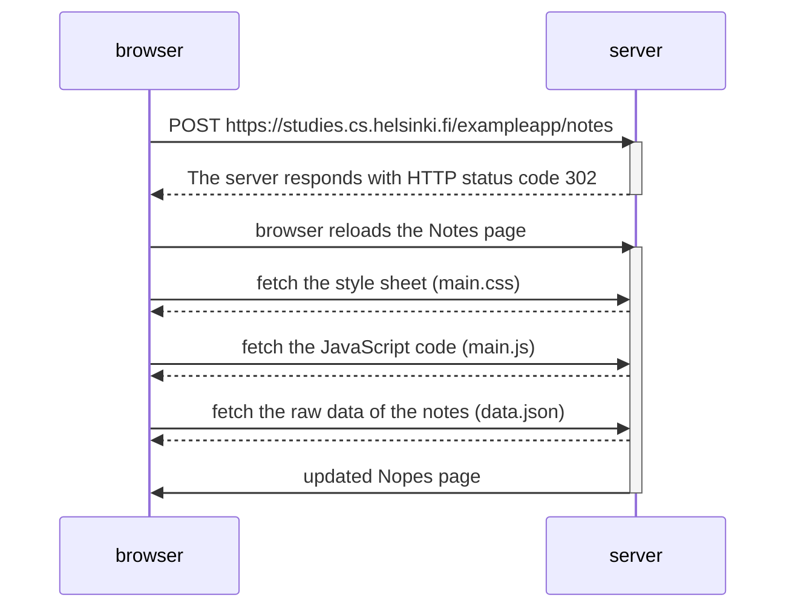

```mermaid
sequenceDiagram
  participant browser
  participant server

    browser->>server: POST https://studies.cs.helsinki.fi/exampleapp/notes
    activate server
    server-->>browser: The server responds with HTTP status code 302
    deactivate server

    browser->>server:  browser reloads the Notes page
    activate server

    browser->>server:  fetch the style sheet (main.css)
    server-->>browser:

    browser->>server:  fetch the JavaScript code (main.js)
    server-->>browser:

    browser->>server:  fetch the raw data of the notes (data.json)
    server-->>browser:

    server->>browser: updated Nopes page
    deactivate server
```
