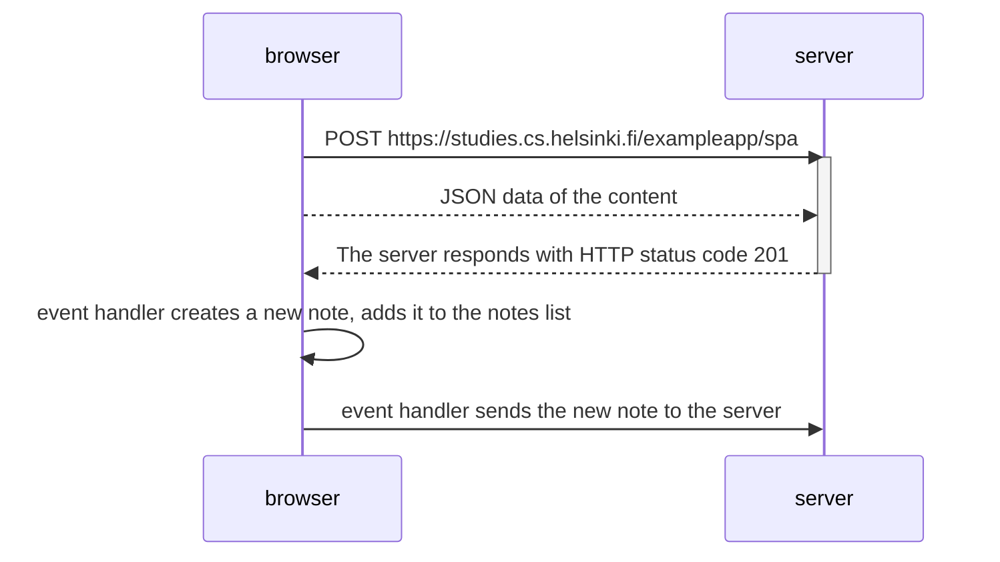

```mermaid
sequenceDiagram
  participant browser
  participant server

    browser->>server: POST https://studies.cs.helsinki.fi/exampleapp/spa
    activate server
    browser-->>server: JSON data of the content
    server-->>browser: The server responds with HTTP status code 201
    deactivate server

    browser->>browser: event handler creates a new note, adds it to the notes list
    browser->>server: event handler sends the new note to the server
```
